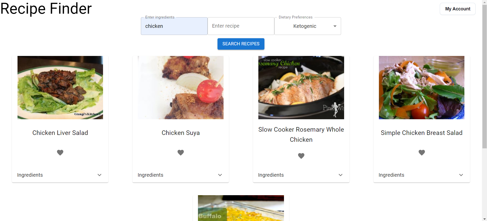
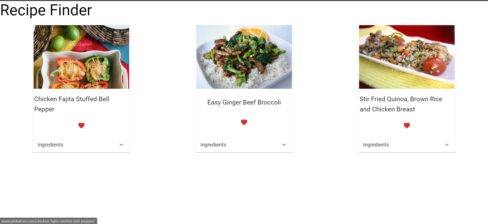
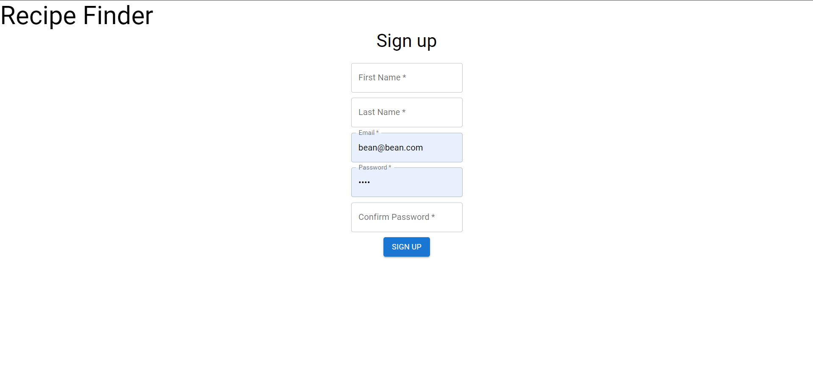

# Welcome to Recipe Suggester!

This is a full-stack web application I created in my spare time. It allows the user to find a recipe based off of the parameters: ingredients, recipe name, and dietary restrictions. The user is able to make an account and save recipes that they like to their account!

*WARNING*

The API being used for this application has a small request limit of 150/day on the free version. It is very easy to hit this limit if you decide to spam requests, so please keep this in mind.

## Screenshots




## Steps to Run

1. Install [Docker](https://docs.docker.com/get-docker/) and ensure it is running.
2. Clone this repo:
   ```bash
   git clone https://github.com/Rionic/Recipe-Suggester-App.git
3. Navigate to the project folder:
   ```bash
   cd Recipe-Suggester-App
4. Start the app:
   ```bash
   docker-compose up --build
   
## Current features

- React as framework
- Material UI for crisp and clean interface
- Spoonacular API to fetch recipe data
- CSS for styling
- Prettified code
- Login system
- Save recipes to account
- Database
- Dockerization

## Potential Future features

- Cloud DB
- Web delopyment
- More detailed profile page
- Nicer UI
- Test cases
